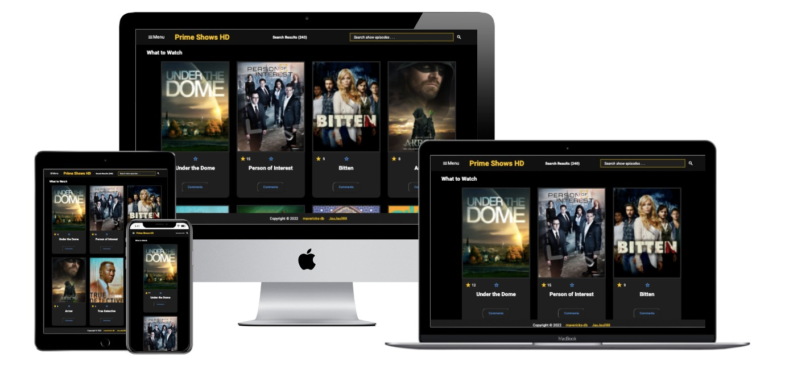

  

# Project Name : FilmHub HD. 
## Microverse Second Capstone Project
> This educational project is to build our own web application based on an external API. We selected an API that provides data about a topic that we like and built the web app around it. The web app will have 2 user interfaces.
<br>



## Built With ⚒

- Linters (Lighthouse, Webhint, Stylelint, Eslint)
-  Languages: HTML, Sass, JavaScript **ES6 syntax**
 - **Linters**: Lighthouse, Webhint, Stylelint and ESLint
 - Module Bundler: **Webpack**
 - Module Bundler Loaders: Style, CSS and Sass
 - Module Bundler Plugins: HtmlWebpackPlugin, FaviconWebpackPlugin, MiniCssExtractPlugin and CssMinimizer Plugin
 - **APIs**: TVmaze API and Involvement API
 - Git/GitHub work-flow
 - Code Editor: VS Code

## :red_circle: Live Demo (If availabale)

[Live Demo Link](https://github.com/khitermedachraf/My-readme-template/blob/main/README.md)

## Learning Objectives 🔖 🕜

- Use JavaScript to make websites dynamic and build basic single page apps.
- Use ES6 syntax.
- Use ES6 modules.
- Use callbacks and promises.
- Use webpack.
- Apply JavaScript best practices and language style guides in code.
- Use AAA pattern for unit tests.
- Write units tests for a JavaScript app.
- Follow Gitflow.
- Solve simple git conflicts.
- Send and receive data from an API.
- Use API documentation.
- Understand and use JSON.
- Make JavaScript code synchronous.
- Perform a code review for a team member.

## Getting Started 🔰

To get a local copy up and running follow these simple example steps.
- Open terminal
- Clone this project by the command: 
```
git clone git@github.com:khitermedachraf/Awesome-books-ES6.git
```
- Then go to the main folder using the next command:
```
cd Awesome-books-ES6.git
```
- Finally, run diplay the index.html file in your local browser, or also, you can use Live Server in Visual Studio Code.

To get a local copy up and running follow these simple example steps.

### Prerequisites ⏮
- A web browser like Google Chrome
- IDE to edit and run the code (We use Visual Studio Code 🔥).
- Git to versionning your work.

You can check if Git is installed by running the following command in the terminal.
```
git --version
```
Likewise for Node.js and npm for package installation.
```
node --version && npm --version
```

### Install 💻

```
npm install --save-dev hint@6.x
```
```
npm install --save-dev stylelint@13.x stylelint-scss@3.x stylelint-config-standard@21.x stylelint-csstree-validator@1.x
```
```
npm install --save-dev eslint@7.x eslint-config-airbnb-base@14.x eslint-plugin-import@2.x babel-eslint@10.x
```
 - For the **node modules** and **Packages.json** dependencies use:
 ```
npm install
```
 - For the run of the webpack dev server use:
 ```
npm start
```

### Usage 🎯

- For anyone who wants to Use **webpack to bundle JavaScript, SCSS**
- For anyone who wants to practice html5, css3, JavaScript/ES6 and consuming **APIs**
- For anyone who wants to create his own FilmHub Website.

### Run tests 🧪

- run: ```npx hint .```
- run: ```npx stylelint "**/*.{css,scss}"```
- run: ```npx eslint .```

### Deployment 🧿

This app is deployed in the GitHub Pages for easy viewing upon merged on the main branch.
Please find the link in the Live Demo section.

## Authors 👥

👤 **Achraf KHITER**

- GitHub: [](https://github.com/khitermedachraf/)
- LinkedIn: [](https://www.linkedin.com/in/khitermed/)
- Gmail: [](mailto:@khiter.med7@gmail.com)
- Twitter: [](https://twitter.com/AchrafKhiter)
- Instagram: [](https://www.instagram.com/khitermed07/)
- Facebook: [](https://www.facebook.com/achraf.khiter.750/)


## Contributing 🤝

Contributions, issues, and feature requests are welcome!

Feel free to check the [issues page](../../issues/).

## Show your support ✨

Give a ⭐️ if you like this project!

## Acknowledgments 🎓💪

- Hat tip to anyone whose code was used
- Inspiration
- Microverse program
- My standup team
- Coding partners

## 📝 License ☑

This project is [MIT](./MIT.md) licensed.
